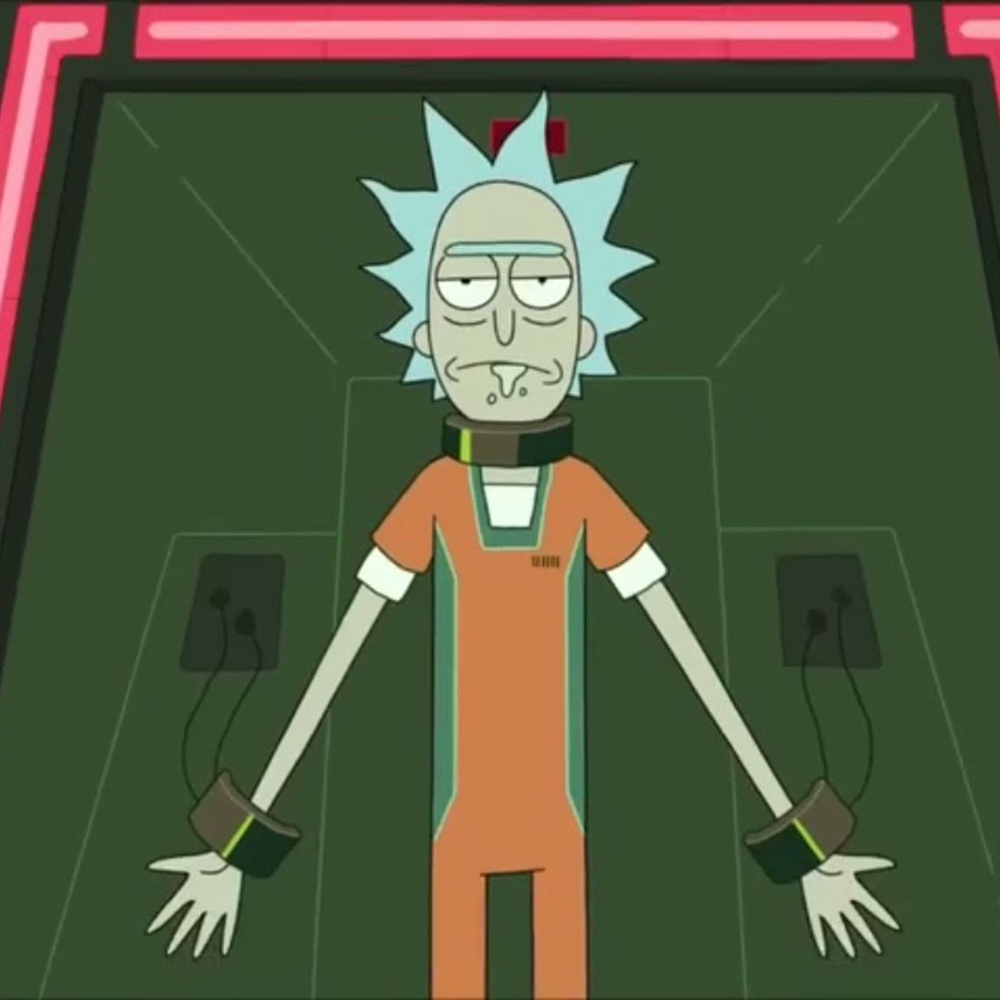

# Rick and Morty Memory Game

The Rick and Morty Memory game is for the Mortiest of Morty's Rick and Morty Fan. Test your memory by trying to remember the placement of all of the pictures as they flash on the screen. Good luck! 

## Technology Used 
- HTML
- CSS 
- JavaScript 

## Approach

I created a one-player game using my current knowledge of front-end technologies. I started with the HTML and styled the cards so that they were flippable and then I started on the logic. I focused more on the functionality of the cards at first and being able to add and remove the hover class, then I worked on being able to match the cards, and then I focused on being able to shuffle the cards. 

## Notes.md

You can check out my notes.md file to see my process on how I kept track of where I was in my code and how I focused on solving my goals. 

## Unsolved Problems / Stretch Goals 

1. Allow players to select the amount of cards they want to be able to play with 
2. Timer 
  - Timer Stretch
  - Allow player to answer a trivia question to add more time, if they get it right they get more time, if they get it wrong, they lose time 
3. Choose different levels of difficulty 
  - This will be associated with how many cards and time 
4. If the user gets three trivia questions correct they get a match
5. Be able to reset game or start a new game when they have won
6. Trivia functionality to receive a hint

## MVP Goals 

1. The user should be able to see the cards upon loading the browser
2. The user should be able to how many matches they have gotten correct and how many matches they have left 
3. The user should be able to flip two cards to see if they match 
4. If the user gets a match correct they should be able to see part of the background image behind the cards
5. The user should be able to use the hint button once to see the cards again 
6. The user should be able to reset the game using the Reset Game button 
7. The user should be able to know when they have won the game 
8. The user should be able to start a new game once they have won

## Wireframe

